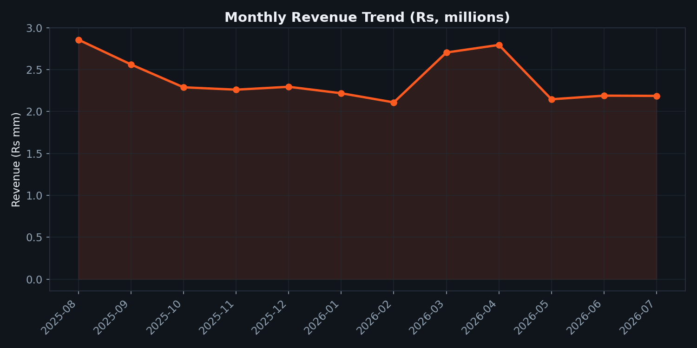
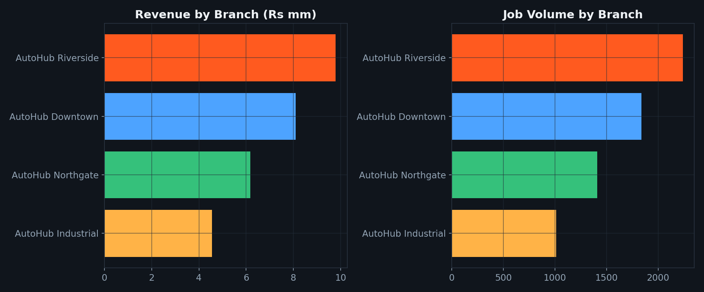
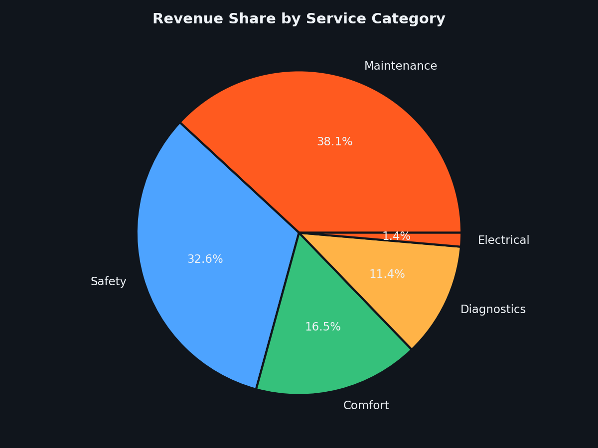
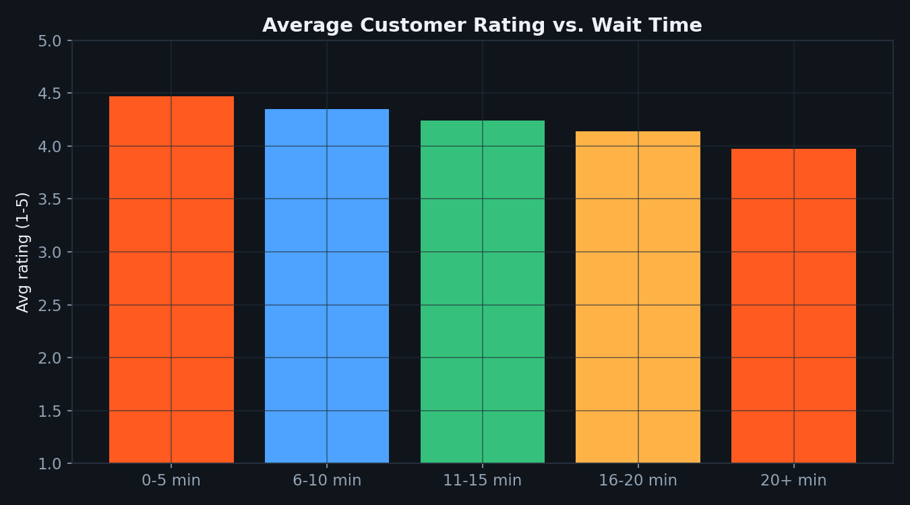

<div align="center">

# 🚗 AutoHub Analytics
### End-to-End Data Analytics Portfolio Project

<p align="center">
A complete <b>Data Analytics</b> project simulating a real-world Business Intelligence workflow for a multi-branch vehicle service company.
</p>

<p align="center">


</p>

---

### ⭐ If you find this project useful, don't forget to star the repository!

</div>

---

# 📑 Table of Contents

- Overview
- Features
- Project Architecture
- Dataset
- Dashboard
- Exploratory Data Analysis
- Key Insights
- Business Recommendations
- Technologies
- Installation
- Results
- Future Improvements
- Author

---

# 🚀 Overview

AutoHub Analytics is an end-to-end Data Analytics project designed to demonstrate the complete analytics workflow followed by professional Data Analysts.

The project transforms raw operational booking data into actionable business insights through:

- 📊 Data Cleaning
- 📈 Exploratory Data Analysis
- 📉 Business Visualization
- 📋 Interactive Excel Dashboard
- 💡 Executive-Level Recommendations

This repository showcases practical skills in:

- Python
- Pandas
- NumPy
- Matplotlib
- Microsoft Excel
- OpenPyXL
- Business Intelligence
- Dashboard Design

---

# ✨ Features

✅ Synthetic Real-World Dataset

✅ 6,500+ Service Records

✅ 12 Months of Operational Data

✅ 4 Branches

✅ 12 Technicians

✅ Excel Dashboard

✅ Formula-Based KPIs

✅ Business Recommendations

✅ Professional Charts

✅ Reproducible Dataset Generator

---

# 📂 Project Structure

```text
AutoHub-Analytics
│
├── README.md
├── AutoHub_Analytics_Dashboard.xlsx
│
├── data/
│   └── autohub_service_bookings.csv
│
├── scripts/
│   ├── generate_dataset.py
│   ├── analysis.py
│   └── build_excel_dashboard.py
│
├── charts/
│   ├── 01_monthly_revenue_trend.png
│   ├── 02_branch_revenue_volume.png
│   ├── 03_category_revenue_share.png
│   ├── 04_service_popularity.png
│   ├── 05_rating_vs_wait.png
│   ├── 06_demand_heatmap.png
│   └── 07_technician_performance.png
│
└── report/
    └── findings.txt
```

---

# 📊 Dataset Overview

| Metric | Value |
|---------|------:|
| Records | 6,500 |
| Time Period | 12 Months |
| Branches | 4 |
| Cities | 4 |
| Service Types | 10 |
| Categories | 5 |
| Technicians | 12 |
| Payment Methods | 4 |

---

## Dataset Includes

- Booking Information
- Vehicle Details
- Customer Information
- Branch Details
- Technician Assignment
- Revenue
- Customer Ratings
- Wait Time
- Duration
- Payment Methods
- Booking Status

---

# 📈 Dashboard Preview

> **Replace these placeholders with screenshots**

## Revenue Analysis



---

## Branch Performance



---

## Service Categories



---

## Customer Satisfaction



---

# 📉 Exploratory Data Analysis

The project automatically generates seven business-focused visualizations.

| Analysis | Description |
|-----------|------------|
| Monthly Revenue | Revenue Trend |
| Branch Revenue | Branch Comparison |
| Revenue Share | Service Categories |
| Service Popularity | Most Requested Services |
| Customer Ratings | Wait Time Impact |
| Demand Heatmap | Peak Business Hours |
| Technician Performance | Productivity Comparison |

---

# 📊 Excel Dashboard

The Excel dashboard is fully automated using **OpenPyXL**.

### Dashboard KPIs

- Total Bookings
- Completed Jobs
- Revenue
- Average Rating
- Average Wait Time
- Completion Rate

### Dashboard Charts

- Monthly Revenue
- Branch Comparison
- Category Distribution
- Monthly Jobs

Every KPI updates automatically when the raw data changes.

---

# 📌 Key Business Insights

## Operational Performance

| KPI | Value |
|------|------:|
| Total Bookings | 6,500 |
| Completion Rate | 92.9% |
| Cancelled | 4.0% |
| No Show | 3.1% |

---

## Financial Performance

💰 **Revenue**

**Rs 28,621,620**

---

## Best Performing Branch

🏆 AutoHub Riverside

- Highest Revenue
- Highest Bookings
- Highest Customer Satisfaction

Average Rating

⭐ **4.19 / 5**

---

## Best Technician

👨‍🔧 Imran Qureshi

- 543 Jobs
- ⭐ 4.26 Rating

---

## Customer Satisfaction

Negative correlation between

- Wait Time
- Customer Rating

Correlation:

**-0.32**

Reducing wait time directly improves customer satisfaction.

---

## Peak Business Hours

📅 Friday

🕛 12:00 PM

Highest customer demand across all branches.

---

# 💼 Business Recommendations

### Improve Peak Capacity

Increase staffing during Friday lunchtime.

---

### Optimize Branch Operations

Use Riverside as the benchmark for operational efficiency.

---

### Increase Revenue

Bundle Maintenance + Diagnostics packages.

---

### Reduce No-Shows

Implement appointment reminders via SMS or Email.

---

### Improve Customer Experience

Focus on reducing wait times to increase customer ratings.

---

# 🛠 Technology Stack

| Category | Technologies |
|-----------|--------------|
| Language | Python |
| Analysis | Pandas, NumPy |
| Visualization | Matplotlib |
| Dashboard | Excel |
| Automation | OpenPyXL |
| Version Control | Git, GitHub |

---

# ⚙ Installation

```bash
git clone https://github.com/yourusername/autohub-analytics.git

cd autohub-analytics

pip install pandas numpy matplotlib openpyxl
```

---

# ▶ Run Project

```bash
cd scripts

python generate_dataset.py

python analysis.py

python build_excel_dashboard.py
```

---

# 📚 Skills Demonstrated

✔ Data Cleaning

✔ Data Analysis

✔ Exploratory Data Analysis

✔ Business Intelligence

✔ Dashboard Development

✔ Excel Automation

✔ Statistical Analysis

✔ Business Reporting

✔ Data Visualization

✔ Python Programming

✔ Git & GitHub

---

# 🔮 Future Improvements

- Power BI Dashboard
- Tableau Dashboard
- SQL Database
- Streamlit Web App
- Predictive Analytics
- Revenue Forecasting
- Machine Learning
- Interactive Filters
- Executive PDF Reports
- Automated Email Reporting

---

# 👨‍💻 Author

## Abdul Wasay

**BS Computer Science (Data Science)**

📊 Data Analytics

📈 Business Intelligence

🐍 Python

🗄 SQL

📉 Power BI

📋 Excel

---

<div align="center">

### ⭐ Star this repository if you found it helpful!

Made with ❤️ by **Abdul Wasay**

</div>
